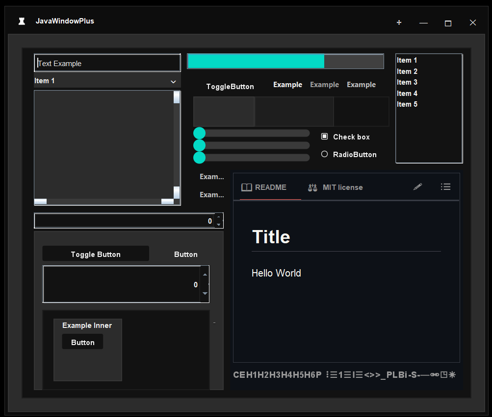
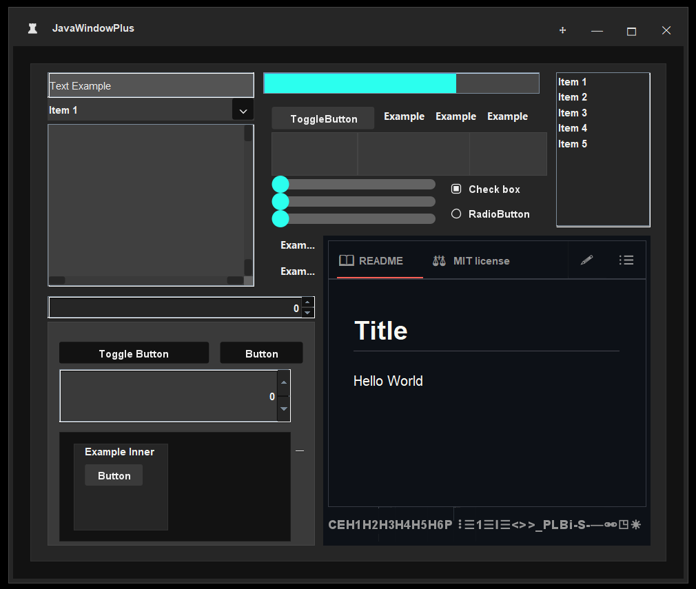
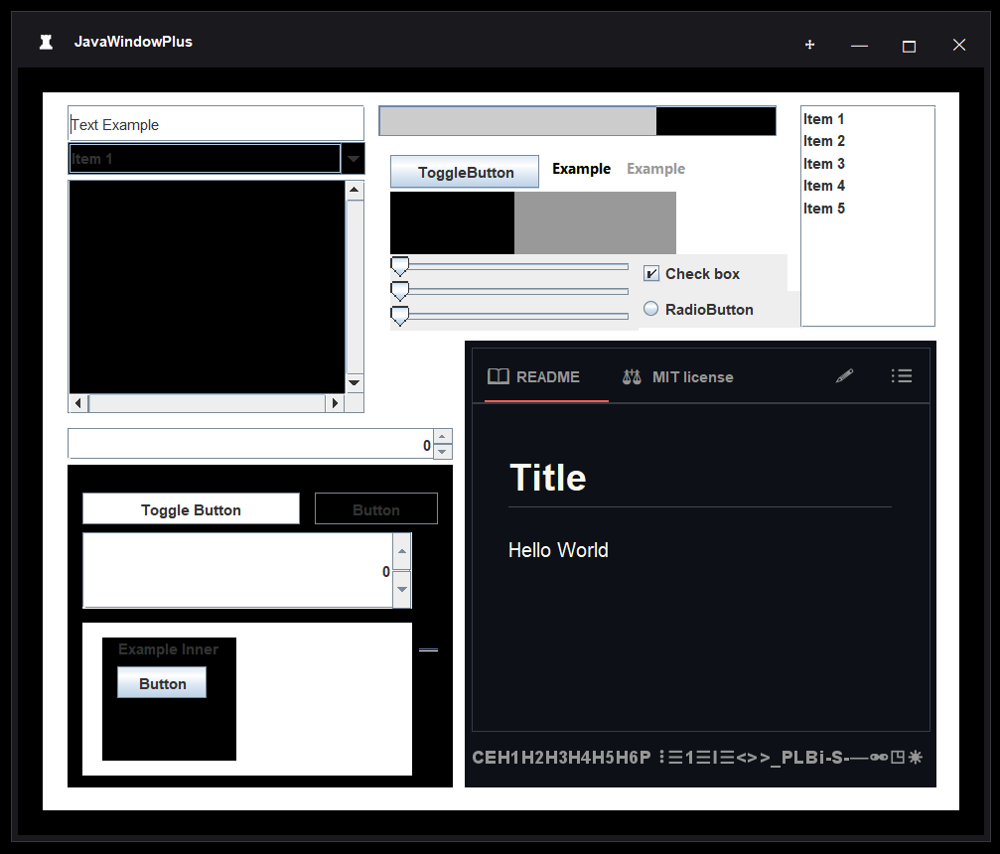

# JThemeManager

**JThemeManager** es una librería para Java Swing que permite aplicar interfaces personalizadas mediante una paleta de colores minimalista. Los temas se pueden aplicar de dos formas: **por jerarquía de componentes** o **por tono de luminosidad**, utilizando archivos `.properties`.

---

## 🎨 Modo: Theme By Tone

Este modo se aplica de forma **manual** y ofrece un alto control sobre la apariencia de cada componente. Utiliza una **escala de grises simplificada** (negro, gris, blanco) para definir los tonos del tema: color primario, secundario y terciario. El texto se adapta de manera similar, permitiendo personalizar el color de cualquier componente de forma precisa.

**Ejemplo visual:**



---

## 🧭 Modo: Theme By Level

Este modo aplica el tema de forma **automática**, siguiendo una lógica jerárquica: desde el componente padre hasta los hijos, **incrementando o disminuyendo la luminosidad** según el nivel de profundidad, hasta un máximo de 3 niveles, luego de los cuales se reinicia el tono original.

**Ejemplo visual:**



> Por defecto, se utiliza el modo **Theme By Level** por ser más sencillo y automático. Para activar el modo por tono se debe usar explícitamente el método `setThemeByTone()` (ver más abajo).

**Ventana base sin tema aplicado:**



---

## 🚀 Cómo utilizar

En la carpeta `dist` encontrarás el archivo `.jar` con la librería, que incluye:

* `ThemeManager`
* `JWindowPlus` (ventana personalizada)
* `PathUtils` (utilidades para manejo de rutas externas)

Una vez agregada la librería a tu proyecto, puedes cargar temas de diversas formas:

---

### 🔧 Crear una instancia

```java
ThemeManager themeManager = ThemeManager.getInstance();
```

Esto garantiza una única instancia del ThemeManager a lo largo del proyecto (singleton).

---

### 🎨 Cargar un tema

```java
// Temas por defecto o desde propiedades en código
themeManager.loadThemeFromProperties(themeManager.getDarkThemeDefault(), "darkTheme");
themeManager.loadThemeFromProperties(themeManager.getLightThemeDefault(), "lightTheme");

// Tema a partir de un color base
themeManager.loadThemeFromColor(Color.BLACK);

// Tema desde recursos internos (classpath)
themeManager.loadThemeFromResource("/themes/dark.properties");

// Tema desde archivo externo
themeManager.loadThemeFromFilePath("C:/miProyecto/temas/custom.properties");

// Intenta cargar desde archivo externo o recurso si no se encuentra
themeManager.loadThemeFromFileOrDefault("C:/externo.properties", "/temas/default.properties");
```

---

### ✨ Aplicar un tema

```java
// Modo automático (por jerarquía)
themeManager.setTheme(window);

// Modo manual (por tono de luminosidad)
themeManager.setThemeByTone(window);
```

> **Importante:** Si usas el modo `setThemeByTone`, asegúrate de llamarlo **antes** de aplicar cualquier tema, para que se conserven correctamente los valores de luminosidad originales. Los componentes se registran automáticamente la primera vez que se llama.

---

### 💾 Aplicar tema a una ventana guardada

```java
// Guardar la ventana principal
themeManager.saveMainWindow(window);

// En otra clase o momento:
themeManager.setThemeInMainWindow();
themeManager.setThemeByToneInMainWindow();
```

---

## 🖼️ Uso de JWindowPlus

`JWindowPlus` es una clase personalizada que extiende de `JFrame`. Está diseñada para ser altamente modificable y adaptable al contenido.

### Ejemplo de uso

```java
// Crear una instancia pasando el panel principal del diseño
JavaWindowPlus window = new JavaWindowPlus(panel);

// Hacerla visible y centrarla en pantalla
window.setVisiblePlusRelativeTo(null);
```

### Características

* Se ajusta automáticamente al tamaño preferido del panel hijo.
* Permite personalizar el borde, el título, y agregar botones o elementos al `title bar`.
* Totalmente compatible con los temas aplicados por `JThemeManager`.

---

## 📄 Ejemplo de archivo `.properties` aceptado

```properties
primary=#121212
secondary=#1e1e1e
tertiary=#2c2c2c
error=#cf6679
success=#03dac6
neutral=#9e9e9e
neutral_2=#bdbdbd
text=#efefef
```

---

## 📜 Licencia

Este proyecto está bajo la licencia **MIT**. Es completamente **libre para uso personal, comercial, educativo o de código abierto**. Puedes modificarlo, distribuirlo y utilizarlo sin restricciones.

---

